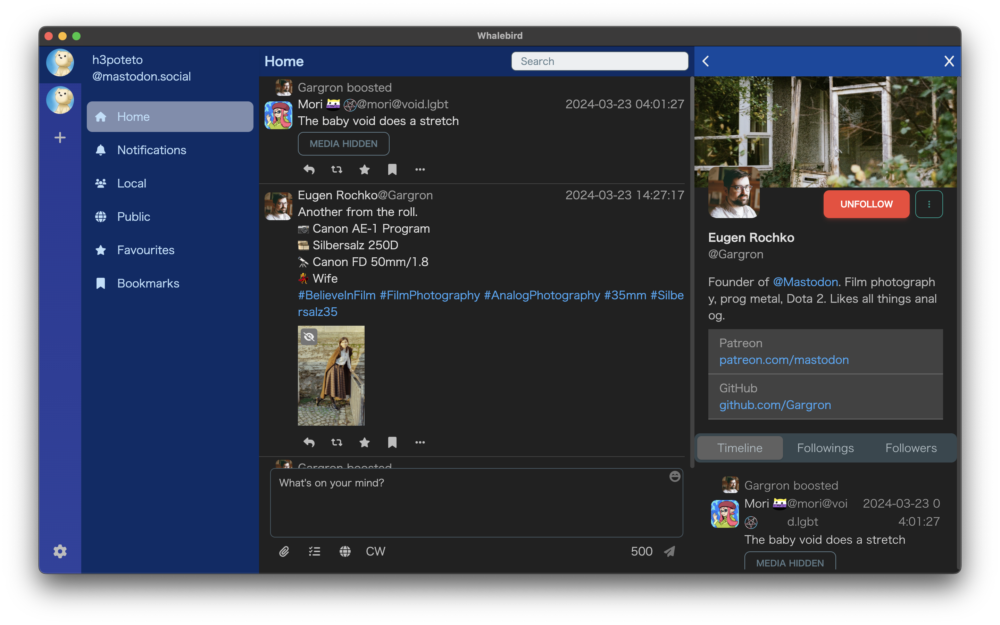

# Whalebird
[](https://github.com/h3poteto/whalebird-desktop/releases)

Whalebird is a mastodon client for desktop application. If you want to use release build, please download from [release page](https://github.com/h3poteto/whalebird-desktop/releases).



## Feature

- An interface like slack
- Notify to desktop
- Streaming
- Many keyboard shortcuts
- Manage multiple accounts

### Shortcuts

<table>
<thead>
<tr><th></th><th>Mac</th><th>Linux, Windows</th></tr>
</thead>
<tbody>
<tr><td> Toot, Reply                    </td><td>             <kbd>Cmd + Enter</kbd>         </td><td> <kbd>Ctrl + Enter</kbd>      </td></tr>
<tr><td> Change accounts                </td><td>             <kbd>Cmd + 1, 2, 3...</kbd>    </td><td> <kbd>Ctrl + 1, 2, 3...</kbd> </td></tr>
<tr><td> Jump to another timeline       </td><td>             <kbd>Cmd + k</kbd>             </td><td> <kbd>Ctrl + k</kbd>          </td></tr>
<tr><td> Open new toot window           </td><td>             <kbd>Cmd + n</kbd>             </td><td> <kbd>Ctrl + n</kbd>          </td></tr>
</tbody>
</table>

## Install
### Mac

You can download `.dmg` from [release page](https://github.com/h3poteto/whalebird-desktop/releases).

Please wait for distribute in Mac app store, I'm preparing.

### Linux

You can download `.deb` or `.rpm` from [release page](https://github.com/h3poteto/whalebird-desktop/releases).
If you do not want to use package manager, please download `.tar.bz2` file and docompress it.

### Windows

You can download `.exe` from [release page](https://github.com/h3poteto/whalebird-desktop/releases).

## Development

``` bash
# clone this repository
$ git clone https://github.com/h3poteto/whalebird-desktop.git
$ cd whalebird-desktop

# install dependencies
$ npm install

# serve with hot reload at localhost:9080
$ npm run dev
```

## Release
### Binary
When you build release packages, please use `electron-builder`.

```bash
# for linux
$ npm run build:linux

# for mac
# This command automatically loads the Developer ID Application certificate from your keychain.
$ npm run build:mac
```

### AppStore

Please prepare certificates on your Apple developer console. The following keys are required:

- Mac App Distribution: `3rd Party Mac Developer Application: NAME (TEAM_ID)`
- Mac Installer Distribution: `3rd Party Mac Developer Installer: NAME (TEAM_ID)`

and register your KeyChain.

Then, create a Mac App ID like `org.whalebird.desktop`.

```bash
$ npm run build:mas

# This command automatically loads the certificates from you keychain.
$ ./appStore.sh
```

After that, the `.pkg` file is created under `./packages`.

# License
The software is available as open source under the terms of the [MIT License](https://opensource.org/licenses/MIT).
