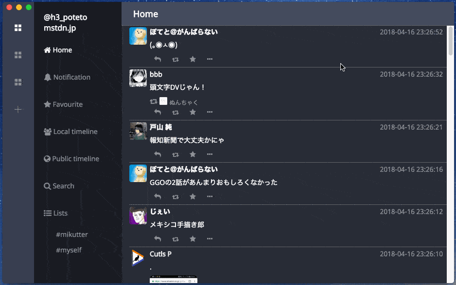

# Whalebird
[](https://circleci.com/gh/h3poteto/whalebird-desktop)
[](https://github.com/h3poteto/whalebird-desktop/releases)
[](https://itunes.apple.com/us/app/whalebird/id1378283354)


Whalebird is a mastodon client for desktop application.



## Feature

- An interface like slack
- Notify to desktop
- Streaming
- Many keyboard shortcuts
- Manage multiple accounts

### Shortcuts

<table>
<thead>
<tr><th></th><th>Mac</th><th>Linux, Windows</th></tr>
</thead>
<tbody>
<tr><td> Toot, Reply                     </td><td>             <kbd>Cmd + Enter</kbd>         </td><td> <kbd>Ctrl + Enter</kbd>      </td></tr>
<tr><td> Change accounts                 </td><td>             <kbd>Cmd + 1, 2, 3...</kbd>    </td><td> <kbd>Ctrl + 1, 2, 3...</kbd> </td></tr>
<tr><td> Jump to another timeline        </td><td>             <kbd>Cmd + k</kbd>             </td><td> <kbd>Ctrl + k</kbd>          </td></tr>
<tr><td> Open new toot window            </td><td>             <kbd>Cmd + n</kbd>             </td><td> <kbd>Ctrl + n</kbd>          </td></tr>
<tr><td> Select next toot                </td><td>             <kbd>j</kbd>                   </td><td> <kbd>j</kbd>          </td></tr>
<tr><td> Select previous toot            </td><td>             <kbd>k</kbd>                   </td><td> <kbd>k</kbd>          </td></tr>
<tr><td> Switch focus to left column     </td><td>             <kbd>h</kbd>                   </td><td> <kbd>h</kbd>          </td></tr>
<tr><td> Switch focus to right column    </td><td>             <kbd>l</kbd>                   </td><td> <kbd>l</kbd>          </td></tr>
<tr><td> Reply to the toot               </td><td>             <kbd>r</kbd>                   </td><td> <kbd>r</kbd>          </td></tr>
<tr><td> Reblog the toot                 </td><td>             <kbd>b</kbd>                   </td><td> <kbd>b</kbd>          </td></tr>
<tr><td> Favourite the toot              </td><td>             <kbd>f</kbd>                   </td><td> <kbd>f</kbd>          </td></tr>
<tr><td> Open details of the toot        </td><td>             <kbd>o</kbd>                   </td><td> <kbd>o</kbd>          </td></tr>
<tr><td> Open account profile of the toot</td><td>             <kbd>p</kbd>                   </td><td> <kbd>p</kbd>          </td></tr>
<tr><td> Open the images                 </td><td>             <kbd>i</kbd>                   </td><td> <kbd>i</kbd>          </td></tr>
<tr><td> Show/hide CW and NSFW           </td><td>             <kbd>x</kbd>                   </td><td> <kbd>x</kbd>          </td></tr>
<tr><td> Close current page              </td><td>             <kbd>esc</kbd>                 </td><td> <kbd>esc</kbd>        </td></tr>
<tr><td> Show shortcut keys              </td><td>             <kbd>?</kbd>                   </td><td> <kbd>?</kbd>           </td></tr>
</tbody>
</table>

## Install
### Mac
[](https://itunes.apple.com/us/app/whalebird/id1378283354)

Or you can download `.dmg` from [release page](https://github.com/h3poteto/whalebird-desktop/releases).

So on, you can install from Homebrew:

```
$ brew update
$ brew cask install whalebird
```

:sparkles: Thanks to [@singingwolfboy](https://github.com/singingwolfboy) for adding it to [homebrew-cask](https://github.com/Homebrew/homebrew-cask/blob/cf568882b6e012956ca404a16be2db36ca873002/Casks/whalebird.rb).


### Linux

You can download `.deb` or `.rpm` from [release page](https://github.com/h3poteto/whalebird-desktop/releases).
If you do not want to use the package manager, please download `.tar.bz2` file and decompress it.

Or please install the app from [snapcraft.io](https://snapcraft.io/whalebird).

```
$ sudo snap install whalebird
```

### Windows

You can download `.exe` from [release page](https://github.com/h3poteto/whalebird-desktop/releases).

## Development

We'd love you to contribute to Whalebird.

### Minimum requirements for development

* Node.js greater than or equal version 8.9.0 (10.x is recommended)
* npm or yarn

### Getting started

``` bash
# clone this repository
$ git clone https://github.com/h3poteto/whalebird-desktop.git
$ cd whalebird-desktop

# Install font config
$ sudo apt-get install libfontconfig-dev

# install dependencies
$ npm install

# serve with hot reload at localhost:9080
$ npm run dev
```

### How to add new language

1. First, please prepare [translation](https://github.com/h3poteto/whalebird-desktop/blob/master/src/config/locales/fr/translation.json), and [translation missing](https://github.com/h3poteto/whalebird-desktop/blob/master/src/config/locales/fr/translation.missing.json) file for your language.
2. Next, add your language to constants like [French](https://github.com/h3poteto/whalebird-desktop/blob/master/src/constants/language.js#L10-L13).
3. Finally, add your language at [here](https://github.com/h3poteto/whalebird-desktop/blob/master/src/renderer/components/Preferences/Language.vue#L37).

If there is something unknown, please refer to this pull request: https://github.com/h3poteto/whalebird-desktop/pull/502


# License
The software is available as open source under the terms of the [MIT License](https://opensource.org/licenses/MIT).

# Donate

[](https://www.patreon.com/bePatron?u=15085320)

[](https://liberapay.com/h3poteto/donate)

Or I prepared Bitcoin Address.


`1EqB53JSWCQDG3NpKpvUyQPJs54e7MxE6z`
